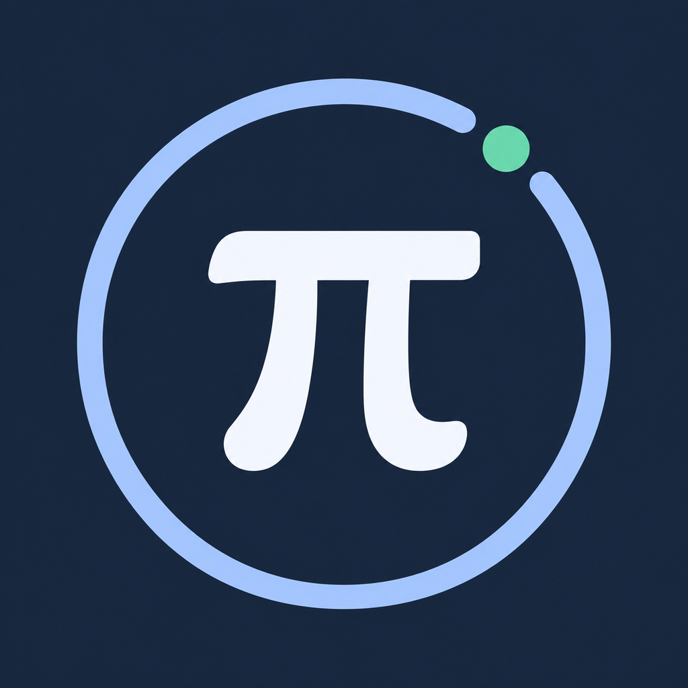
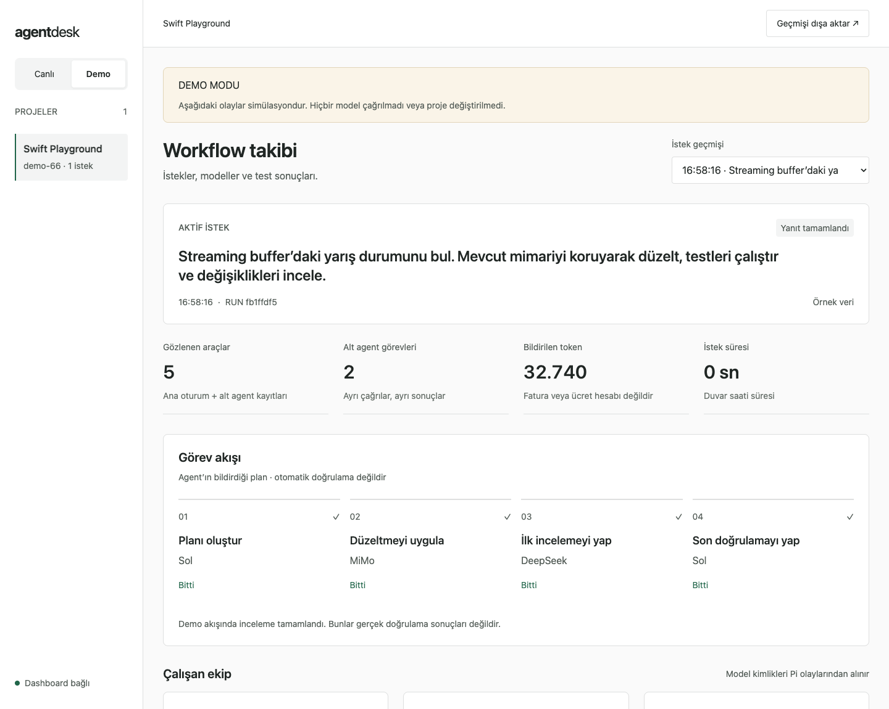

# PiScope

**Your Pi projects, at a glance — anywhere.**

A local-first workflow dashboard **for [Pi coding agent](https://pi.dev) users**.
See what your projects are doing, which agents are working, and where you left
off — without switching between terminal tabs. With optional **Tailscale Serve**,
check the same dashboard from your phone while away from home.

English · [Turkish setup guide](README.tr.md)



*The screenshot uses synthetic data, not real prompts or measured model performance.*

PiScope is a companion to Pi, not another coding agent. It **observes by default**.
Optional [approved continuation](docs/CONTROL.md) and [daily report generation](docs/DAILY-REPORTS.md) send your confirmed prompt to
an existing, idle Pi session; Pi can then edit files or run tools using its
current model, permissions and quota. PiScope does not choose providers or call
models directly. No additional model subscription or API key is needed.
The dashboard UI is in English; your project names, prompts and responses stay
in their original language.

## What you can follow

- **All your monitored Pi projects:** one card per project, even across several sessions.
- **Recent context:** last request, last response, last work time and reported plan step.
- **Daily report:** one **Generate report** button summarizes the selected day
  across all tracked projects with the current Pi model, plus remaining work and **Copy report**.
- **Response beside continuation:** read the selected request's **Last model response**
  inside **Continue this project**, alongside Recommended and Other.
- **Provider errors:** reported model/provider failures appear on project cards and
  in a separate detail alert; inactive projects show an **Error** badge.
- **Live work:** main model, subagent calls, tools, handoffs and activity feed.
- **Unfinished work:** distinguish running, waiting, blocked and unknown outcomes.
- **Workflow comparisons:** profile versions, observed models, duration and reported tokens.
- **Test reports:** explicitly attached JUnit summaries, separate from execution status.
- **Persistent history:** short project summaries survive dashboard restarts.
- **Phone access:** private HTTPS viewing over Tailscale, including outside your home Wi-Fi.
- **Optional continuation:** review **Recommended** suggestions or write **Other**;
  confirm before sending to an open, idle Pi session. Separate control pairing is required.

Cards stay in project-name order instead of jumping around during live updates.
Use search and status filters, **Open last request**, and **Back to projects** to
move between the overview and details. Long saved text expands with **Show more**.
Cards in the same desktop row have equal heights, with next steps and actions
aligned at the bottom. Expanded text and larger fonts grow the row without
clipping content; mobile cards keep their natural height.

**“Last request finished” does not mean the entire project is complete or tests
passed.** Plan steps are agent reports, not proof of execution. Missing outcomes
remain unknown; missing usage is not zero, and tokens are not a cost estimate.

## Your daily work report

Open **Daily report** to answer “What did I get done today?” Choose a date, then
click the single **Generate report** button. Review the chosen Pi session, current
model and exact context from all included projects; **Confirm and generate in Pi**
starts one normal model request for the entire day, not one per project. It needs
the [three control opt-ins](#4-optional-continue-pi-from-the-dashboard) and an updated
extension with `daily_report` and prompt capture on in just that one execution session.
Other tracked projects can be closed/offline; their retained daily work is still included.
No new API key, provider integration, model switch or automatically spawned Pi is used.
Generation consumes the existing model's quota; merely viewing the report does not.

**Use the model from this Pi session** selects the report writer, **not a project
filter**. A ready session is selected automatically when available; your explicit
choice is retained. The current model is shown separately, and disconnected
historical sessions are not offered as new targets. Only one ready execution
session is needed for the overall report. The confirmation panel separates report
scope, day, model and Pi session. **View exact prompt and context** expands the
full input; model-quota and permission warnings stay visible beside confirmation.

**If Generate report is disabled**, the panel beside it explains why and shows
relevant setup steps; no permissions are enabled automatically:

| State | What to do |
|---|---|
| Viewing only | Open the separate **Control pairing** link in this browser. Viewing pairing alone cannot send work. |
| Setup needed / Session needed | Enable collector control, open a current Pi session with a finished request, and use `/dashboard-control on` in that session. |
| Update needed | Update only the chosen project's extension from the PiScope directory, restart Pi, and re-enable local control. Reporting requires `daily_report` and prompt capture; selecting an old extension alone cannot enable generation. |
| Busy | Let Pi finish, or select another ready session. PiScope does not interrupt active work. |
| No context | Choose a day with captured work text. Missing or expired history cannot be reconstructed. |

The LLM combines captured work across tracked projects into one overall daily report, instead of
listing prompts or model replies. **Remaining / blocked** is separate; plans and
failed attempts must not be presented as accomplishments. Summaries are AI reports,
not independent verification of changes or passing tests. Input is bounded, with
coverage shown; old or omitted work can be missing. More work marks a summary
out of date, without automatic regeneration. A failed generation keeps the previous
successful summary rather than replacing it with an error or normal chat response.

There are no per-project generation buttons or report cards; desktop and phones
show one report. Use **Previous**, **Next**, **Today** and **Copy report**. Computer and phone use
the displayed report timezone. Review private content before sharing a copied report.

**After updating:** restart PiScope with your existing control/Tailscale settings,
refresh the browser, and update only the report-producing project's extension
from the PiScope directory with `npm run install:pi -- "/absolute/path/to/project" --update`. Restart that
project's Pi runtime, then explicitly re-enable `/dashboard-control on` when ready.
Do not interrupt active work just to upgrade. Viewing pairing alone cannot generate.
[Generation, sources, timezone, retention and limitations](docs/DAILY-REPORTS.md).

## 1. Run PiScope locally

You need **Node.js 22+**, a browser, and an existing Pi installation for live
monitoring. There are **no npm runtime dependencies**, no `npm install` step,
and no frontend build.

```bash
git clone https://github.com/TemelGunaydin/PiScope.git
cd PiScope
npm start
```

Keep this terminal running. In a **second terminal**, from the PiScope directory:

```bash
npm run open
```

This opens the browser with a private pairing link. You can also open the link
printed by `npm start`. After pairing, use **http://127.0.0.1:7331** on the same
machine. `npm start` starts the server; `npm run open` only opens and pairs your
browser. It does not start the server.

> Treat pairing links as passwords. Do not post them in issues, screenshots or
> public chats. PiScope is a local application, not a GitHub Pages website.

macOS has been exercised locally; core CI is configured for Linux and macOS.
Windows is not currently validated. Live model/subagent compatibility was
checked with Pi **0.87.1** and pi-open-agents **0.1.22**. Other subagent packages
may need an adapter; model identities are not tied to a specific provider.

## 2. Add your Pi projects

There is no manual “Add project” form and no disk scan. **Install the monitoring
extension into each project, then work in Pi as usual.** Python, Swift, Node.js
and other projects can be monitored — the target does not need `package.json`.

### Install from the PiScope directory

```bash
# Run these in PiScope, NOT in the projects you want to monitor.
npm run install:pi -- "/absolute/path/to/project-one"
npm run install:pi -- "/absolute/path/to/project-two"
```

The installer copies `.pi/extensions/agent-dashboard/` into each selected
project. It does not change your models, API keys, MCP settings or agent
configurations. Use only one copy per Pi session: avoid installing the same
extension both globally and locally.

### Open Pi in the target project

```bash
cd /absolute/path/to/project-one
pi
```

In Pi:

```text
/reload
/dashboard-status
```

You should see **`PiScope: connected`**. Give Pi a normal task; the project will
appear in PiScope when its work is recorded. Repeat for other projects. If you
already have a Pi session open in the project, try `/reload`; if the commands
are missing or the old extension remains loaded, restart Pi.
`/dashboard-status` checks delivery — it does not start a task.

### Optional: show the agent's plan

Model and tool events are monitored automatically. Stage lists and next steps
require your agent to use the extension's **`workflow_report`** tool. To append
optional reporting instructions to the project's `AGENTS.md`:

```bash
npm run install:pi -- "/absolute/path/to/project" --update --instructions
```

`--update` replaces only this extension and backs up the previous copy.
`--instructions` preserves existing instructions and backs them up before
appending guidance. Omit it if you do not want to change `AGENTS.md`. If your
orchestrator limits available tools, allow `workflow_report` in its existing
configuration. This tool reports a plan; it does not run or delegate the work.

### Update or remove a project installation

After pulling updates to PiScope:

```bash
npm run install:pi -- "/absolute/path/to/project" --update
```

Restart that project's Pi runtime after updating: `/reload` alone may keep old
imported modules. Re-enable `/dashboard-control on` if you use control. Restart
PiScope when collector code changes, preserving your control/Tailscale settings.
Web-only changes need just a browser refresh, not an extension reinstall.
To uninstall, remove only `.pi/extensions/agent-dashboard/` and restart Pi.
Recorded history is kept.
Existing data and installs retain their original `agent-dashboard` paths and
`AGENT_DASHBOARD_*` settings for compatibility with earlier versions.

## 3. Follow progress from your phone with Tailscale

**Away from home?** Leave Pi working on your computer and check its projects,
agent activity and latest responses from your phone over mobile data or another
Wi-Fi network. No public server or router port forwarding is needed.

Install [Tailscale](https://tailscale.com) on the computer running PiScope and on
your phone. Sign both into the same tailnet and keep Tailscale connected. The
computer must stay **awake, online, with PiScope running**; live progress also
requires the Pi session to keep running. The normal pairing link grants viewing
only; [optional control](#4-optional-continue-pi-from-the-dashboard) requires a
separate opt-in and pairing.

### Find your computer's Tailscale name

On the computer:

```bash
tailscale status --json | node -e 'let s="";process.stdin.on("data",c=>s+=c).on("end",()=>console.log(JSON.parse(s).Self.DNSName.replace(/\.$/,"")))'
tailscale serve status
```

Replace `my-computer.my-tailnet.ts.net` below with your machine's exact name.
The name belongs to the **computer**, not the project. Different apps need
separate HTTPS ports. This example uses **8443** so an existing app on **443**
can stay untouched; check that 8443 is free too.

### Start PiScope with its HTTPS origin

Stop the existing dashboard with `Ctrl+C`, then run from the PiScope directory:

```bash
AGENT_DASHBOARD_TAILSCALE_ORIGIN="https://my-computer.my-tailnet.ts.net:8443" npm start
```

In another terminal, enable the private proxy:

```bash
tailscale serve --bg --https=8443 http://127.0.0.1:7331
tailscale serve status
```

Tailscale may ask you to enable HTTPS for your tailnet; follow its setup link.
**Use Serve, not Funnel.** Serve is private to your tailnet; Funnel is public.

### Pair the phone's browser

Open the **Tailscale browser pairing** link printed by `npm start` in a **new tab
on your phone**. Keep the token private. After pairing, bookmark the plain URL:

```text
https://my-computer.my-tailnet.ts.net:8443/
```

The same HTTPS URL works on the computer too:

```bash
npm run open -- --tailscale  # Opens and pairs this computer's browser only
npm run open                # Local access still works
```

You do **not** need to run `npm run open` before every phone visit. Pair once per
browser, then use the bookmark while the server is running. Local and HTTPS
hostnames pair independently. The HTTPS origin setting is required on each
PiScope start; plain `npm start` without it enables local-only access.

To disable only PiScope's Serve endpoint:

```bash
tailscale serve --https=8443 off
```

Do not reset all Serve routes or overwrite another app's port. PiScope still
listens on loopback: `http://100.x.y.z:7331` is **not** a supported access URL.
If you change `PORT`, update Serve's backend target too.

A paired browser can read/export **all** retained projects. Restrict access to
trusted devices/users through your tailnet grants/ACLs. Pi ingestion remains
local. See [full Tailscale setup and troubleshooting](docs/TAILSCALE.md).

## 4. Optional: continue Pi from the dashboard

Control is **off by default**, including on the phone. To enable it:

1. Restart PiScope with `AGENT_DASHBOARD_CONTROL=1 npm start`. Keep your
   `AGENT_DASHBOARD_TAILSCALE_ORIGIN` setting too if using the phone.
2. From PiScope, update the target project's extension with
   `npm run install:pi -- "/absolute/path/to/project" --update`.
3. Restart Pi in that project to load the updated extension, then run
   `/dashboard-control on` and `/dashboard-status`.
4. Open the **Control pairing** link printed by PiScope in the intended browser.
   On iPhone, open it in a new Safari tab; pairing the Mac does not pair the phone.

Open the project's latest request. Choose **Recommended → Review and start**,
or write **Other → Review prompt**. Inspect the target and exact prompt, then
**Confirm and send to Pi**. No task starts without that click. Suggestions come
from `workflow_report`; nothing is invented or automatically continued.

The same panel shows the selected request's **Last model response**, even in
view-only mode. Long recorded excerpts scroll; unrelated live updates preserve
reading position, text selection and unsent Other drafts. Pi-reported errors,
such as Codex overload, appear separately rather than as successful output.
A new attempt or successful reply clears the current warning; historical errors
remain in the activity feed. Active projects retain **Running**. PiScope never
automatically retries these errors or changes models; Pi's own retry settings
still apply. Older records may have only a generic error notice. Detailed error
capture requires the updated project extension and Pi/collector restarts above.

Closed, busy, unsettled and old-request targets are blocked. Double submissions
are reserved; an **unknown** receipt is never automatically retried. **Submitted**
means sent to Pi's input, not successful execution. Existing Pi permissions and
model/workflow configuration stay in place; work may consume model quota.
Use `/dashboard-control off` or restart PiScope without the control setting to
revoke new submissions. This does not abort existing Pi work.

[Activation, phone pairing, recommendations, receipts and security details](docs/CONTROL.md).

## Workflow profiles and test reports

To compare workflow versions, add `.pi/agent-dashboard.workflow.json` to a
monitored project. Start with [the example](examples/workflow-profile.json),
using your actual agent names. Profiles label workflows; they do not choose
models. New requests capture their own profile and observed model identities.
Use the same `taskSet` for comparable workloads; that label is not proof of
identical inputs. [Detailed workflow guide](docs/WORKFLOWS.md) (Turkish).

After a request finishes, before starting another, attach a project-local JUnit
report from that request in the same Pi session:

```text
/dashboard-evidence reports/junit.xml
```

PiScope reads the report; it does not run tests. Old, invalid or out-of-project
reports are rejected. Empty or entirely skipped reports are inconclusive.
An imported report is not independent proof of current code quality or test
execution. [Supported formats and trust boundaries](docs/EVIDENCE.md) (Turkish).

## Data and privacy

- Records stay on the Pi machine in `~/.agent-workflow-dashboard/` (the retained
  compatibility path). No cloud telemetry, external frontend CDN or direct model calls.
  Opt-in approved prompts resume Pi with its existing model usage.
- Set `AGENT_DASHBOARD_HOME` in **both Pi and PiScope** to change the data directory.
  Keep it outside the repository. Do not commit records or pairing information.
- If the server is offline, Pi persists accepted events and retries delivery.
  Default queue limits: **5,000 pending events / 20 MiB per client**. New events
  are rejected at capacity; accepted history is kept. Check `/dashboard-status`.
- The journal rotates and detailed history is bounded. Short project summaries
  survive longer (up to **500 live projects**, separately from hidden demo data).
  Daily context retains up to **1,000 day/request records and 12 MiB per mode**;
  generated reports separately retain up to **500 entries and 2 MiB**, one overall
  report per day; retained legacy per-project reports share that budget.
  Exports contain retained state, not an unlimited archive. Deleting journals
  alone does not erase project summaries or daily excerpts.
  [Project memory](docs/PROJECTS.md) · [Daily reports](docs/DAILY-REPORTS.md).
- Prompt/response excerpts and provider error messages can contain private
  information. Error details are bounded and redacted; secret redaction is not
  complete data-loss prevention. To omit prompt, task, response and detailed error text:

  ```bash
  AGENT_DASHBOARD_CAPTURE_PROMPTS=0 pi --continue
  ```

  File names, model identities and reported stages may still be recorded.
  This also omits reported recommendations and accomplishments; generic error
  notices remain visible. Daily generation is disabled with this setting.
  It does not purge previously captured or generated data.
  Control prompts still reach Pi when approved.
- Same-user OS processes can read local records. Tailscale is an extra network
  boundary, not per-project or multi-user authorization. Review exports before
  sharing, and keep pairing links, queues and `connection.json` private.

## Development and contributing

```bash
npm run check
npm test
# Optional installed-Pi integration check (no model calls):
npm run test:pi
npm run test:pi:control  # Real Pi input delivery, intercepted before any model call
```

Core tests need no Pi installation, credentials or paid models. Optional browser
checks use a disposable collector, synthetic data and no personal history:

```bash
# Requires Python Playwright + Chromium; --tailscale also requires openssl.
python test/browser-smoke.py --network
python test/browser-smoke.py --tailscale
python test/control-browser.py
python test/control-browser.py --tailscale
python test/daily-browser.py
python test/daily-browser.py --tailscale
```

The Tailscale test simulates an HTTPS proxy; real phone access must still be
verified on your tailnet. macOS checks do not establish every OS/Pi/provider
combination. [Verification history](docs/VERIFICATION.md).

Bug reports and focused contributions are welcome. See [CONTRIBUTING.md](CONTRIBUTING.md),
[Code of Conduct](CODE_OF_CONDUCT.md) and [Security policy](SECURITY.md).

## License

[MIT](LICENSE). PiScope is an independent community project, not an official
product of Pi, Tailscale, OpenAI or any model provider. Pi and pi-open-agents
are separate projects; mentioning them does not imply endorsement.
